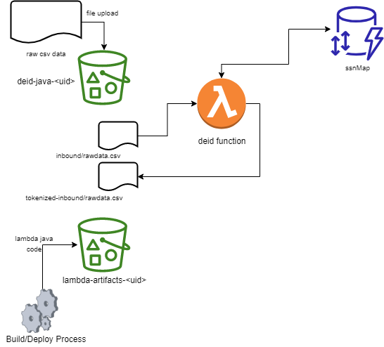

# Deidentifier S3 - Lambda POC

The project source includes function code and supporting resources:

- `function/lambda_function.py` - The Python3 Lambda function that implements the deidentification logic.
- `function/lambda_function.test.py` - A unit test and helper function (not currently in use - see below).
- `rawdata1.csv` - Sample rawdata.csv file containing fake user info (including fake SSNs)
- `template.yml` - The CFT that creates the de-id python application.
- `1-build-layer.sh`, `2-deploy.sh`, etc. - Shell scripts that use the AWS CLI to deploy and manage the DE-ID application.

Use the following instructions to deploy the deidentification POC app.

# Requirements
- [Python3]
- [pip3] 
- The Bash shell
- [The AWS CLI](https://docs.aws.amazon.com/cli/latest/userguide/cli-chap-install.html) v1.17 or newer.

# Setup
Download or clone this repository.

    $ git clone https://github.com/leidosdaren/deindentification.git
    $ cd deidentification

Manually create a bucket for the DE-ID deployment artifacts.

Update the 'bucket-name.txt' file with the name of the artifact bucket.

To build a Lambda layer that contains the function's runtime dependencies, run `1-build-layer.sh`.

    $ ./1-build-layer.sh

# Deploy
To deploy the application, run `2-deploy.sh`.

    py-deid % ./2-deploy.sh

    Successfully packaged artifacts and wrote output template to file out.yml.
    Execute the following command to deploy the packaged template
    aws cloudformation deploy --template-file /py-deid/out.yml --stack-name <YOUR STACK NAME>

    Waiting for changeset to be created..
    Waiting for stack create/update to complete
    Successfully created/updated stack - py-deid

This script uses AWS CloudFormation to deploy the Lambda functions and an IAM role. If the AWS CloudFormation stack that contains the resources already exists, the script updates it with any changes to the template or function code.

# Test
This Lambda function is triggered by dropping a data file in the inbound/ directory of the `py-deid-bucket-<random_uuid>` S3 bucket.

When the deidentification process is complete, the `py-deid-bucket-<random_uuid>` bucket will contain
the de-id'ed version of the file in the `deid-java-bucket-<random_uuid>/outbound` folder.

# Cleanup
To delete the application, run `3-cleanup.sh`.

    $ ./3-cleanup.sh
